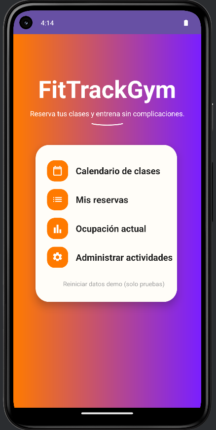
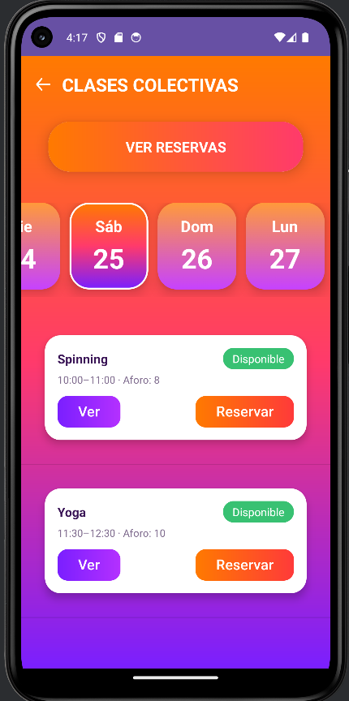
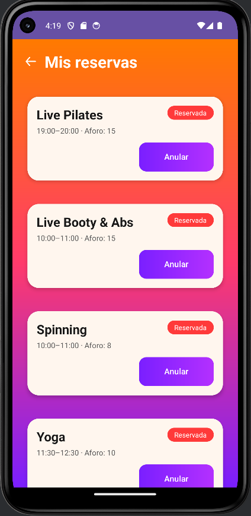
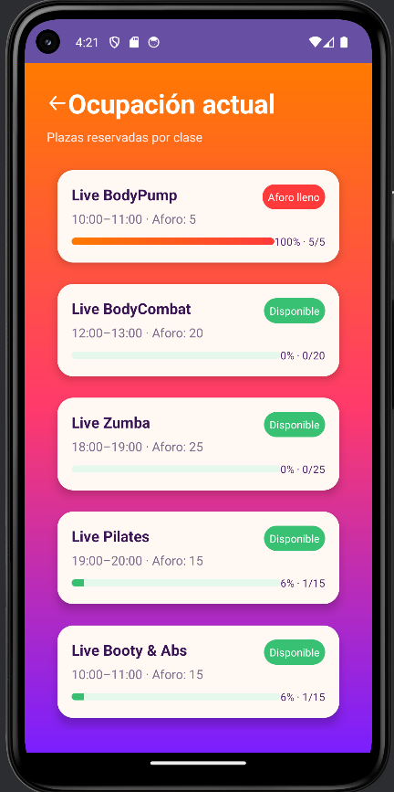
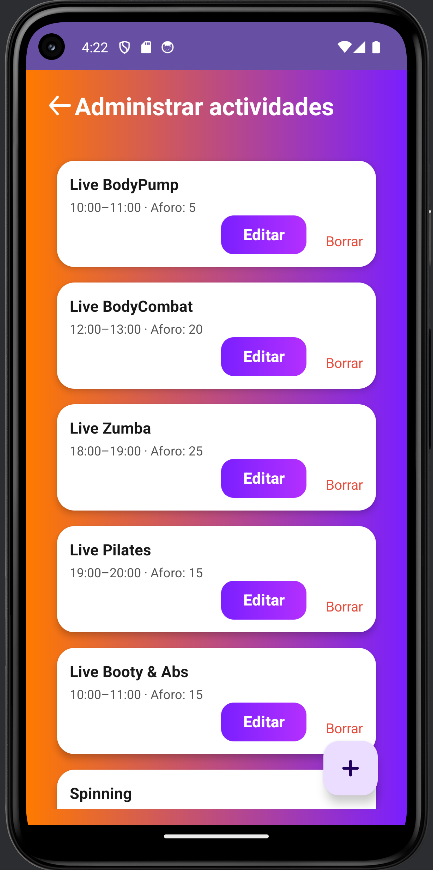

# 🏋️ FitTrackGym

Aplicación móvil Android para la gestión de reservas y control de aforo en gimnasios, desarrollada como proyecto final del ciclo de Desarrollo de Aplicaciones Multiplataforma (DAM).

## 📱 Descripción
FitTrackGym permite a los usuarios consultar actividades, realizar reservas y gestionar su participación en clases de forma sencilla e intuitiva. 
Además, incluye funcionalidades administrativas para la gestión de actividades dentro del gimnasio.

## 🚀 Funcionalidades Principales
- 📅 Visualización de calendario de clases
- 📝 Reserva y cancelación de actividades
- ⏳ Gestión de lista de espera
- 👤 Gestión de usuario
- 🏋️ Panel de administración de actividades
- 📊 Visualización de ocupación en tiempo real
- 💾 Persistencia de datos local

## 🛠 Tecnologías utilizadas
- **Kotlin**  
- **Android Studio**  
- **Arquitectura MVVM**  
- **Room (SQLite)**  
- **LiveData**  
- **XML (Layouts)**  
- **DAO**  
- **UML (Diseño previo)**

## 🧠 Arquitectura
La aplicación está desarrollada siguiendo el patrón **MVVM (Model - View - ViewModel)**, lo que permite:
- Separación de responsabilidades
- Código más mantenible
- Mejor gestión del estado

## 💾 Base de datos
Se utiliza **Room** como sistema de persistencia local, facilitando el acceso y gestión de datos mediante DAOs garantizando eficiencia en las operaciones.

## 📸 Capturas de pantalla

### 🏠 Pantalla principal

### 📅 Calendario de clases colectivas 

### 📋 Detalle de reservas

### ⛳Ocupación actual de clases reservadas

### 📚 Gestor de administrador 

## 📦 Instalación
- Descargar el archivo APK desde el repositorio 
- Instalar en un dispositivo Android
- Ejecutar la aplicación

## 🎯 Objetivo del proyecto
Desarrollar una solución que permita gestionar reservas en gimnasios de forma eficiente, mejorando la organización y la experiencia del usuario.

## 👩‍💻 Autor
**María Yulisa Misas Valencia**

Desarrolladora de aplicaciones multiplataforma 

## 📌 Estado del proyecto
✔ Proyecto finalizado  
📚 Desarrollo académico (DAM)  
🚀 Disponible como parte de portfolio profesional

