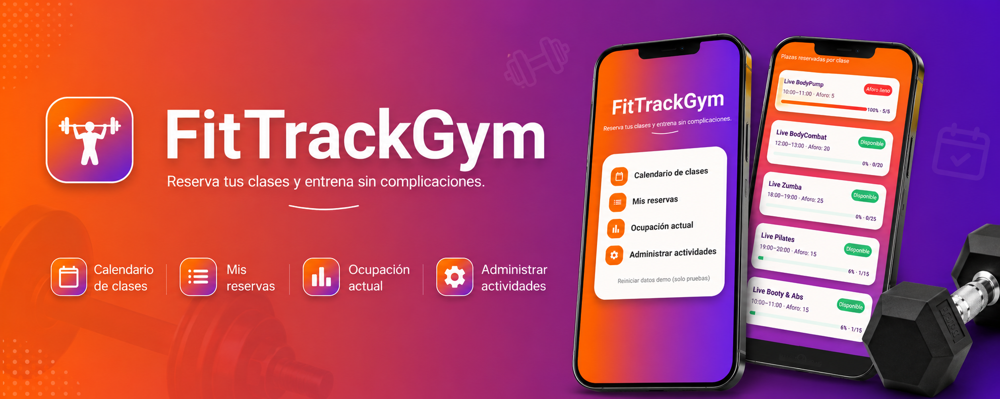
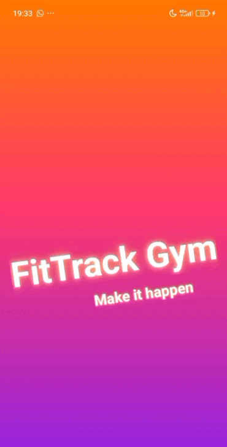
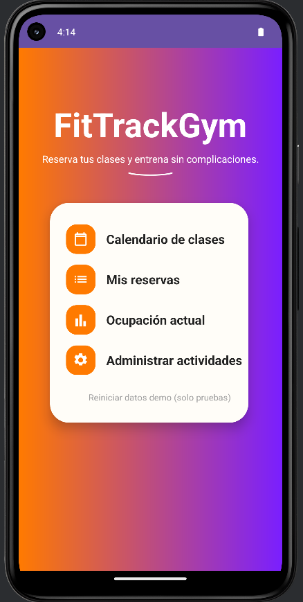
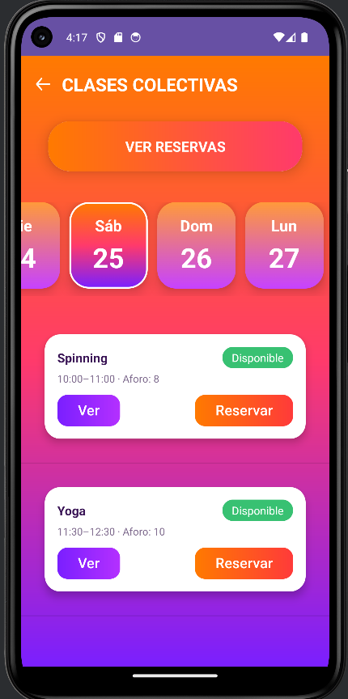
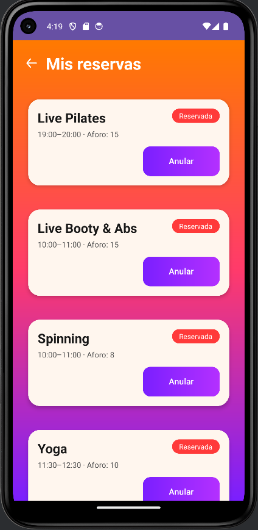
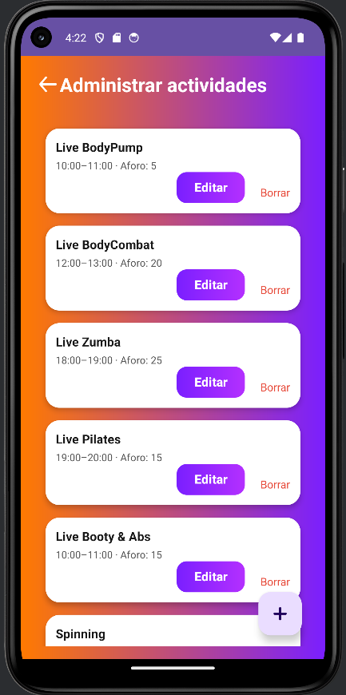
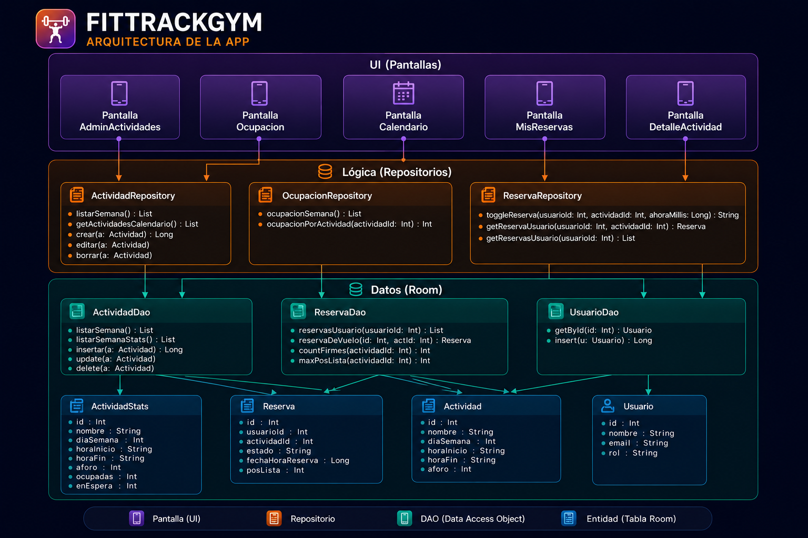

  

# 🏋️ FitTrackGym

Aplicación móvil Android para la gestión de reservas y control de aforo en gimnasios

📚 Proyecto final del ciclo de Desarrollo de Aplicaciones Multiplataforma (DAM)

## 📱 Sobre el proyecto
FitTrackGym es una aplicación Android diseñada para optimizar la gestión de gimnasios, permitiendo a los usuarios reservar actividades, gestionar su participación en clases y consultar disponibilidad en tiempo real.

Incluye además un panel administrativo para la gestión de actividades, mejorando la organización interna del gimnasio y el control de aforo.

## 🎬 Demo de la aplicación

  

## 🎯 Objetivo 
Desarrollar una solución digital eficiente para la gestión de reservas en gimnasios, mejorando la experiencia del usuario y la administración de recursos dentro del centro deportivo.

## 🚀 Funcionalidades Principales
👤 Usuario
- 📅 Consulta de calendario de actividades
- 📝 Reserva y cancelación de clases
- ⏳ Lista de espera automática
- 👤 Gestión de perfil de usuario
- 📊 Visualización de disponibilidad en tiempo real
  
🧑‍💼 Administrador
- 🏋️ Gestión de actividades
- 📊 Control de aforo
- ➕ Creación, edición y eliminación de clases

## 📸 Capturas de pantalla

  
  
  
   

## 🧠 Arquitectura del sistema
El proyecto sigue el patrón MVVM (Model - View - ViewModel):

UI → ViewModel → Repository → Room Database → DAO

- Separación de responsabilidades
- Código escalable y mantenible
- Gestión eficiente del estado
- Mejor testabilidad

  

## 💾 Base de datos
Se implementa Room (SQLite abstraction) para la persistencia local:
- DAO para acceso estructurado a datos
- Consultas optimizadas
- Manejo seguro de datos locales
- Integración con LiveData

## 🛠 Tecnologías utilizadas
- **Kotlin**  
- **Android Studio**
- **XML (UI Design)**
- **MVVM Architecture**  
- **Room Database**  
- **LiveData**   
- **DAO (Data Access Objects)**  
- **UML (Diseño previo del sistema)**

## 📦 Instalación
1. Descargar el archivo APK desde Releases 
2. Instalar en un dispositivo Android
3. Ejecutar la aplicación

## 📈 Estado del proyecto

✔ Proyecto finalizado

📚 Desarrollo académico (DAM)

🚀 Incluido en portafolio profesional

📱 Versión funcional Android

## 👩‍💻 Autor

**María Yulisa Misas Valencia**

💻 Desarrolladora de aplicaciones multiplataforma

## 🌟 Enfoque del proyecto
Este proyecto refleja mi interés por el desarrollo móvil, la arquitectura limpia y la creación de soluciones reales orientadas a la experiencia del usuario.
